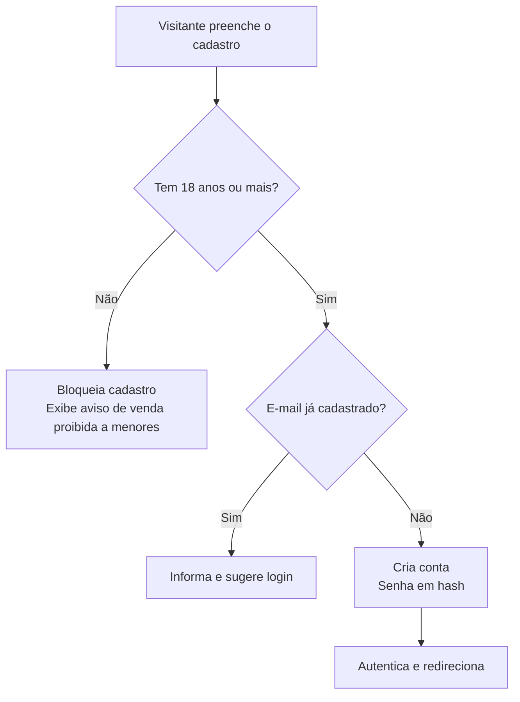
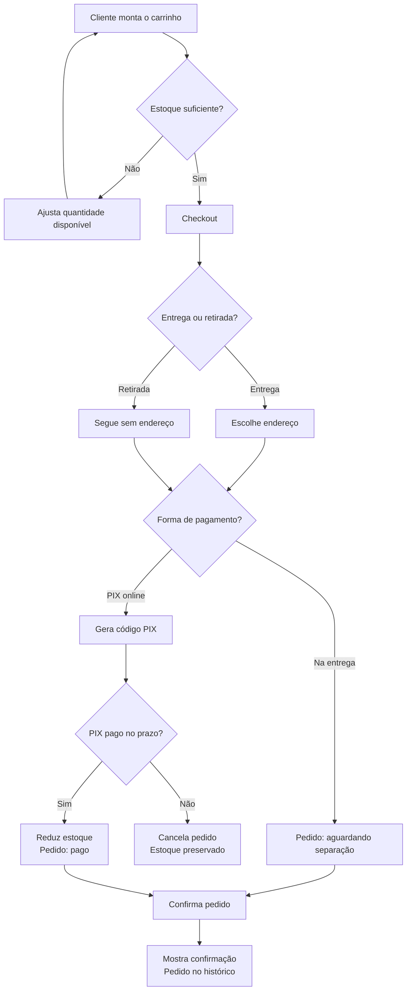
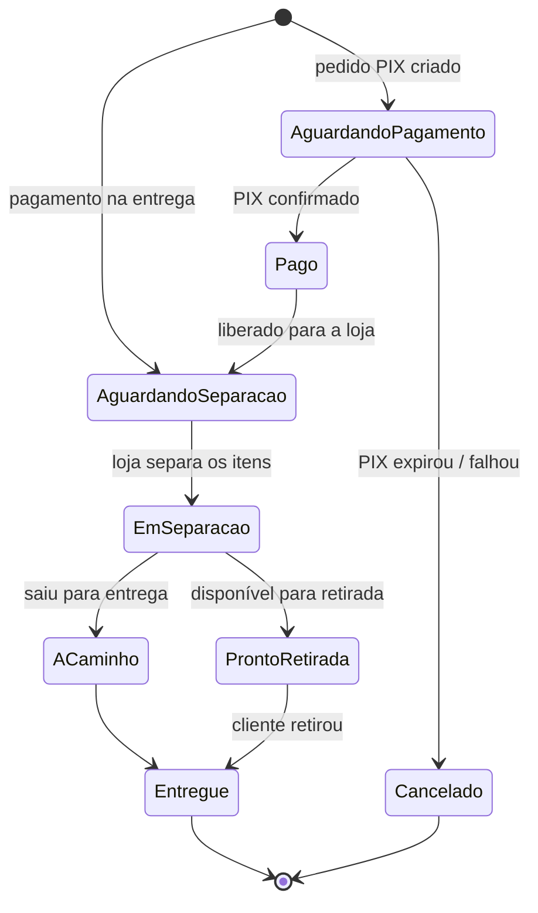

# Fluxos do Sistema — Bebida Loja

> **Fase 1 — Planejamento**
> Última atualização: 2026-06-22

Diagramas dos principais caminhos do sistema. Escritos em **Mermaid** (renderiza
no GitHub e no VS Code com a extensão de Markdown Preview Mermaid).

Os fluxos abaixo são a versão visual dos casos de uso em
[`02-casos-de-uso.md`](./02-casos-de-uso.md).

---

## 1. Fluxo de Cadastro com Verificação de Maioridade (UC-02)

---

## 2. Fluxo de Compra (UC-04) — caminho central do sistema

---

## 3. Ciclo de Vida (Status) do Pedido

Um pedido passa por estados bem definidos. Modelar isso agora evita confusão
quando formos criar o banco de dados (Fase 5) e o painel admin.

> **Observação de arquitetura:** repare que o pagamento na entrega "pula" a etapa
> de pagamento online. Mapear esses dois caminhos agora vai facilitar muito a
> modelagem da tabela de pedidos na Fase 5.
